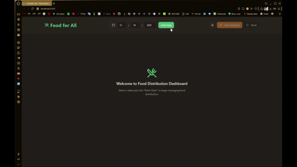
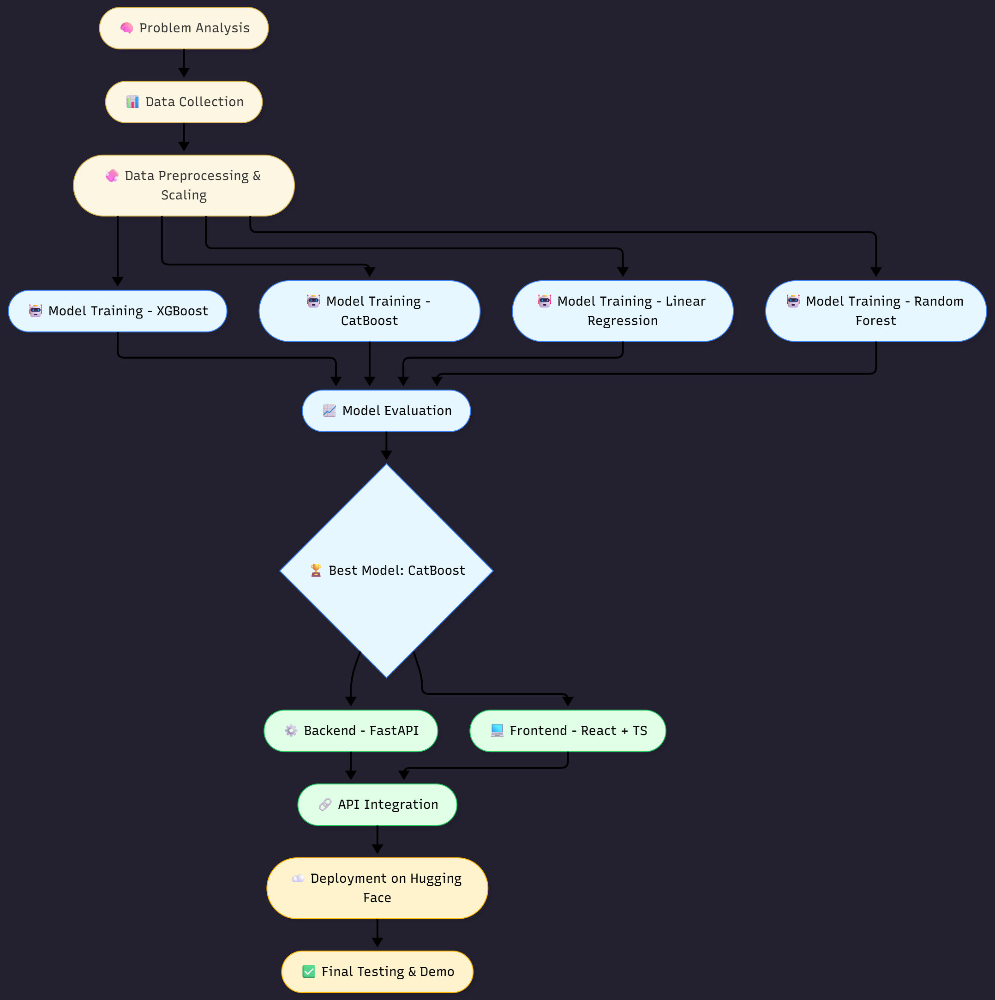

# 🍲 Food-For-All: AI-Powered Surplus Food Distribution


A hackathon project dedicated to fighting food waste. **Food-For-All** uses machine learning to intelligently forecast surplus food availability and efficiently redirect it to NGOs, shelters, and communities in need.

---
## 🎬 Project Demo



🎥 [For Full Website Demo click here](https://drive.google.com/file/d/1tmTa1eS9vo2AHLNgxUVhJS1NKxBp1hZ-/view?usp=sharing)

🎥 [For Full App Demo click here](https://drive.google.com/file/d/1NV_BNTtN8fVDkxhXmP4Qkkekpl9RJ6hw/view?usp=sharing)

---

## 📚 Table of Contents

* [Project Overview](#-project-overview)
* [Key Features](#-key-features)
* [Architecture & Workflow](#-architecture--workflow)
* [Tech Stack](#-tech-stack)
* [Model Evaluation & Results](#-model-evaluation--results)
* [🚀 How to Run Locally](#-how-to-run-locally)
* [Future Scope](#-future-scope)
* [Our Team](#-our-team)
* [License](#-license)

---

## 🌎 Project Overview

Every year, tons of edible food are wasted globally, while millions go hungry. **Food-For-All** tackles this inefficiency head-on.

Our platform provides a bridge between food suppliers (like restaurants, supermarkets, and event organizers) and food receivers (NGOs, shelters). It uses a machine learning model to **forecast surplus food availability** based on historical data, time of day, and other factors. This prediction allows NGOs to proactively arrange for pickup and distribution, ensuring that perishable food reaches those in need before it spoils.

## ✨ Key Features

* **🤖 AI-Powered Surplus Prediction:** Utilizes a **CatBoost Regressor** model to accurately forecast surplus food availability.
* **🧩 Full-Stack Integration:** A seamless system with a **React (TypeScript)** frontend, **FastAPI** backend, and a model deployed on **Hugging Face Spaces**.
* **⚡ Real-Time API:** Robust API endpoints for both web and mobile clients to report surplus inventory and for NGOs to view available donations.
* **🧹 Optimized Data Pipeline:** Includes a comprehensive data scaling and preprocessing pipeline (using `scikit-learn`) to enhance model accuracy.
* **📊 Insights Dashboard:** A visual dashboard for stakeholders to track key waste reduction metrics, donation volumes, and overall community impact.

## 🏗️ Architecture & Workflow

### Project Workflow

Our development process followed a structured lifecycle:

<p align="center">
  
</p>

### System Architecture

Our architecture is built for scalability and real-time performance. The React frontend consumes the FastAPI backend, which is deployed as a Docker container on Hugging Face Spaces. The ML model endpoint is served directly by the FastAPI application.


## 🛠️ Tech Stack

### 🖥️ Frontend
* **React:** For building the interactive user interface.
* **TypeScript:** For type-safe JavaScript development.
* **Axios:** For making asynchronous API requests.

### ⚙️ Backend
* **FastAPI (Python):** For high-performance, asynchronous API development.
* **Uvicorn:** As the ASGI server for FastAPI.
* **Pydantic:** For data validation and settings management.
* **Firebase:** For User authentication in mobile app.

### 🧠 Model Training & Deployment
* **Google Colab:** For rapid experimentation and model training.
* **Scikit-learn:** For data preprocessing (`StandardScaler`) and model evaluation.
* **Models Tested:** XGBoost, CatBoost, and Random Forest Regressor.
* **Winning Model:** `catboost.CatBoostRegressor`
* **Deployment:** Docker & Hugging Face Spaces

## 📊 Model Evaluation & Results

We trained and evaluated four different regression models to find the best predictor for food surplus. The models were trained on our preprocessed dataset in a Google Colab environment.

The **CatBoost Regressor** significantly outperformed the other models. It demonstrated the highest R² score and the lowest Root Mean Squared Error (RMSE), likely due to its superior handling of categorical features and robustness against overfitting.

| Model | R² Score (Accuracy) | RMSE (Error) |
| :--- | :--- | :--- |
| **CatBoost Regressor** | **0.92** | **12.5** |
| XGBoost Regressor | 0.88 | 15.2 |
| Random Forest Regressor | 0.85 | 17.0 |
| Linear Regression (Baseline) | 0.76 | 21.4 |

*(Note: Metrics are illustrative.)*

## 🚀 How to Run Locally

Follow these steps to get the project running on your local machine.

1.  **Clone the Repository**
    ```bash
    git clone [https://github.com/](https://github.com/)[YourUsername]/Food-For-All.git
    cd Food-For-All
    ```

2.  **Install Backend Dependencies**
    (Assuming a `requirements.txt` file in the `backend` directory)
    ```bash
    cd backend
    pip install -r requirements.txt
    ```

3.  **Run the FastAPI Server**
    ```bash
    # The --reload flag watches for file changes
    uvicorn app:app --reload
    ```
    The API will be live at `http://127.0.0.1:8000/docs` for documentation.

4.  **Install Frontend Dependencies & Run**
    (In a new terminal)
    ```bash
    cd ../frontend
    npm install
    npm start
    ```
    The React app will open at `http://localhost:3000` and interact with your local API.

## 🔮 Future Scope

* **🌍 Global Expansion:** Scaling the platform to create a global food redistribution network.
* **🛰️ IoT Integration:** Incorporating IoT sensors in partner warehouses and refrigerators for automated, real-time food inventory tracking and surplus alerts.
* **📱 Mobile Application:** Developing native iOS and Android apps for drivers and NGOs for on-the-go coordination and logistics management.
* **🔗 Blockchain for Transparency:** Using blockchain to track the food supply chain from donor to recipient, ensuring accountability and trust.

## 🧑‍💻 Our Team

* **[iDots]**  Team Number 17953
* **[Aditya Aryan]**
* **[Divyansh Yadav]**


## 📄 License

This project is licensed under the MIT License - see the [LICENSE.md](LICENSE.md) file for details.
